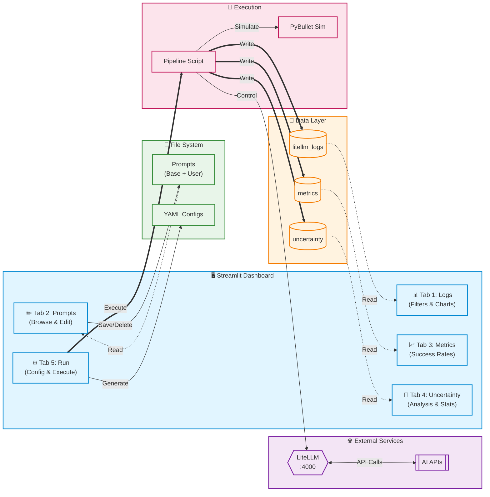

# **OWG Experiment Dashboard**

A Streamlit-based interface for configuring, monitoring, and executing **Open-World Grasping (OWG)** experiments.
The dashboard integrates LiteLLM logs, uncertainty analysis, prompt engineering, configurable pipelines, and experiment execution.

---

## **🌐 Features Overview**

### **1. 🔍 Experiment Logs**

View and analyze LiteLLM API activity:

* Load logs from `logs/litellm_logs.jsonl`
* Filter by model, status, and user
* Display costs, responses, timestamps
* Visual charts:

  * Cost over time
  * Request counts by status
* Summary statistics (success rate, total cost)

---

### **2. 🧩 Prompt Engineering**

A prompt management system for OWG tasks:

* Browse built-in prompts (`prompts/uncertainty_aware`)
* Browse user-created prompts (`prompts/user_defined`)
* Create, edit, and save new prompts
* Delete user-defined prompts
* Preview prompt content

---

### **3. 📈 Metrics Overview**

Monitor outcomes from OWG grasp attempts:

* Load logs from `logs/experiment_metrics.jsonl`
* Display grasp attempt details:

  * Success / failure
  * Object ID
  * Position
  * Retries
* Compute:

  * Total grasps
  * Success rate
  * Avg retries
* Visualizations:

  * Success rate per object
  * Timeline of grasp attempts

---

### **4. 🧠 Uncertainty Analysis**

Analyze uncertainty-aware metadata (entropy & confidence):

* Load logs from `logs/uncertainty_logs.jsonl`
* Automatic extraction of nested metadata
* Reports on missing values, data span, record count
* Trend charts:

  * Entropy over time
  * Confidence over time
* Correlation heatmaps
* Z-score anomaly detection
* Per-model statistics (ranker / planner / grounder)
* Configuration comparison leaderboard
* ANOVA significance testing

---

### **5. 🚀 Run Experiment**

Configure and execute the OWG pipeline:

* Set environment parameters:

  * Random seed
  * Number of objects
  * User query
* Per-stage configuration:

  * Grounding
  * Planning
  * Grasping
* For each stage:

  * Enable/disable
  * Select prompt file
  * Edit prompt templates
  * Select model & parameters (temperature, logprobs, max_tokens, n)
* Save final YAML config to:

  ```
  config/pyb/user_defined/config_<timestamp>.yaml
  ```
* Execute pipeline via:

  ```
  notebooks/owg_evaluation_pipeline.py
  ```
* View stdout/stderr output inside Streamlit
* Manage LiteLLM:

  * Check server status
  * Start LiteLLM

---

## **📁 Directory Structure**

```
OWG/
│
├── app.py                          # Streamlit dashboard
│
├── logs/
│   ├── litellm_logs.jsonl          # LiteLLM request logs
│   ├── experiment_metrics.jsonl    # Grasp attempt logs
│   ├── uncertainty_logs_test.jsonl # Uncertainty metadata logs
│
├── prompts/
│   ├── uncertainty_aware/          # System prompts
│   └── user_defined/               # User-created prompts
│
├── config/
│   └── pyb/
│       └── user_defined/           # Saved YAML configs
│
├── notebooks/
│   └── owg_evaluation_pipeline.py  # Main experiment pipeline
│
└── output/                         # Pipeline outputs
```

---

## **▶️ Running the Dashboard**

### **1. Install dependencies**

```bash
pip install -r requirements.txt
```

### **2. Launch Streamlit**

```bash
streamlit run app.py
```

### **3. Start LiteLLM (optional, if not started via UI)**

```bash
litellm --config config/litellm/config.yaml
```

---

## **🔁 Data Flow Diagram (Mermaid)**



---

## **📌 Summary**

The OWG Dashboard centralizes:

* Experiment configuration
* Prompt engineering
* LLM log analysis
* Uncertainty metrics
* Grasp performance analytics
* Full pipeline execution

This enables fast experimentation, reproducibility, and optimization of grasping performance in open-world robotic tasks.
